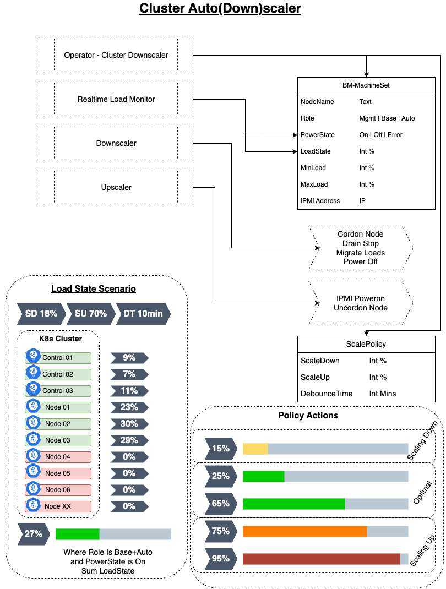

# 3. Cluster Autoscaler

# User stories

## As a Provider I want to minimise my energy costs by scaling down excess capacity, and power back up as demand increases.

# Outcome

- High level design (quick sketch)
- Dropped: ---Working code base with clear documentation and test cases > 80%, pipeline to build and publish the operator package.---

# Workstream

### Tasks

- [x] Define the parameters for our custom machine set resource.
- [x] Create design diagram 
- [ ] Research Steps needed to safely shutdown idle nodes.
- [x] Research Steps to power up nodes (IPMI based).
- [ ] Research Tools to scale up/down load for demo's.
- [ ] Is 'Cluster Downscaler' more accurate term, since the intent is to reduce power usage and save cost if load dictates. 

## References

- https://github.com/kubernetes/autoscaler/blob/master/cluster-autoscaler/cloudprovider/externalgrpc/README.md
- https://isitobservable.io/observability/kubernetes/how-to-autoscale-in-kubernetes-and-how-to-observe-scaling-decisions
- https://samos-it.com/posts/gke-custom-oss-cluster-autoscaler.html
- https://github.com/openshift/cluster-autoscaler-operator
